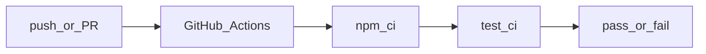

# InstallSentry

> Supply-chain blast-radius visualizer that traces npm install-time lifecycle scripts, file/network access, and secret-canary reads.

[](https://github.com/anasm266/installsentry/actions/workflows/ci.yml)
[](https://nodejs.org/)
[](https://www.typescriptlang.org/)

## At a glance

- **Problem:** `npm install` can run **lifecycle scripts** in dependencies with access to your filesystem, env, and network. That risk is **opaque** if you only read `package.json` at the top level.
- **What this is:** A **CLI** that (1) parses your **`package-lock.json` v3** into a graph, (2) runs a **sandboxed** `npm install` with **canary** secrets, (3) loads a **Node shim** (`NODE_OPTIONS=--require`) to log I/O, (4) writes a single **HTML report** and an optional **install-time gate** (`--ci`).

**Try it in three steps** (from a clone; `npx` works after the package is **published** to npm):

```bash
git clone https://github.com/anasm266/installsentry.git && cd installsentry
npm ci && npm run build
node dist/cli.js scan ./path-to-your-app
node dist/cli.js run ./path-to-your-app -o report.html
```

**Limitations (read before trusting it for production):** only **`package-lock.json` lockfileVersion 3**; **npm** (not pnpm / Yarn for the lockfile layer yet); **strict** `--ci` (e.g. normal **registry** traffic can fail the gate); trace **package** attribution in the report is still **coarse**; the tool is **observational**, not a full static malware guarantee. For a deliberate exfil test case, see **[`tests/fixtures/malware-demo/`](tests/fixtures/malware-demo/)** below.

**Security & responsible use:** The [malware-demo](#malicious-demo-fixture-canary-exfil) fixture is for **local testing and learning** on machines you are allowed to use. Do not point this tool (or the fixture) at systems you do not own, and do not use it to develop or deliver harmful code. InstallSentry is an **educational / research** tool; it is not a substitute for a commercial malware scanner, dependency policy, or formal supply-chain program.

## What it does

Every time you run `npm install`, packages can execute lifecycle scripts (`preinstall`, `install`, `postinstall`) with full access to your environment, filesystem, and network. InstallSentry tells you exactly what happened inside that black box.

- **Scans** `package-lock.json` for packages with lifecycle scripts
- **Sandboxes** `npm install` in a disposable temp directory with fake secrets
- **Traces** `fs.readFile`, `http`/`https` (including `get`), `child_process.spawn` calls via a runtime shim; canary substrings in outbound request URLs are treated as secret exfil
- **Detects** if any package reads your fake canary tokens (npm, AWS, GitHub, SSH)
- **Maps** every suspicious event back to the root dependency that introduced it
- **Reports** everything in a single interactive HTML file with dependency graph, timeline, and blast-radius paths
- **Gates CI** with `--ci` flag — fails the build if secrets are touched or unauthorized network calls are made

## Demo

```bash
# Scan a project for lifecycle scripts
npx installsentry scan ./my-project

# Run sandboxed install and generate report
npx installsentry run ./my-project --output report.html

# CI mode — exits non-zero if anything suspicious happens
npx installsentry run ./my-project --ci
```

### Malicious demo fixture (canary exfil)

The repo includes [`tests/fixtures/malware-demo/`](tests/fixtures/malware-demo/): a root project with a `file:` dependency whose `postinstall` reads `AWS_SECRET_ACCESS_KEY` and issues an HTTPS request with the canary in the query string. The shim flags canary substrings in outbound URLs as **Secret Canary** hits (and still logs **Network Egress**). After `npm run build`:

```bash
node dist/cli.js run tests/fixtures/malware-demo -o malware-report.html
node dist/cli.js run tests/fixtures/malware-demo --ci
```

The last command exits with a non-zero status: both secret exfil and network are detected. Note: event `package` in the trace is not yet attributed per `node_modules` entry (shim default), so the report sidebar is the most reliable “money” view; graph node highlighting for the malicious package is a follow-up.

## Architecture

```
┌─────────────────┐     ┌──────────────┐     ┌─────────────┐
│  package-lock   │────▶│  Lockfile    │────▶│  Dependency │
│    parser       │     │   Parser     │     │   Graph     │
└─────────────────┘     └──────────────┘     └─────────────┘
                                                     │
┌─────────────────┐     ┌──────────────┐            │
│   HTML Report   │◀────│   Analyzer   │◀───────────┘
│  (Cytoscape.js) │     │ (blast radius│
└─────────────────┘     │  + risk score)│
                        └──────────────┘
                               ▲
                               │
┌─────────────────┐     ┌──────────────┐
│  Secret Canary  │     │   Sandbox    │
│  Detection      │◀────│  + Shim      │
└─────────────────┘     │ (fs/net/cp)  │
                        └──────────────┘
```

## How it works

1. **Lockfile Analysis** — Parses `package-lock.json` v3 into a directed acyclic graph. Identifies which packages define `preinstall` / `install` / `postinstall` scripts.
2. **Sandboxed Install** — Creates a temp directory, copies `package.json` + `package-lock.json`, and runs `npm install` with:
   - Fake environment variables (`NPM_TOKEN`, `AWS_ACCESS_KEY_ID`, `GITHUB_TOKEN`, `SSH_PRIVATE_KEY`) containing canary strings
   - A Node.js runtime shim injected via `NODE_OPTIONS=--require` that monkey-patches `fs`, `http`, `https`, and `child_process` to log every call to a JSONL trace file
3. **Trace Analysis** — Reads the JSONL trace, detects canary reads, network egress, file writes, and subprocess spawns
4. **Blast Radius Mapping** — For every suspicious package, walks the dependency graph backward to find the root dependency that transitively introduced it
5. **Report Generation** — Produces a single self-contained `installsentry-report.html` with:
   - Interactive dependency graph (Cytoscape.js)
   - Secret canary alerts
   - Network egress log
   - Blast-radius dependency paths
   - CI gate status

## Installation

From the registry (after [publishing](#publishing-to-npm-optional) or if the name is available):

```bash
npm install -g installsentry
# or
npx installsentry <command>
```

From source, use `node dist/cli.js` after `npm run build` (see [At a glance](#at-a-glance)).

## Usage

### Scan

List all packages with lifecycle scripts:

```bash
installsentry scan ./my-project
```

### Run

Perform a sandboxed install and generate the HTML report:

```bash
installsentry run ./my-project -o report.html
```

### CI Mode

Fail the build if secrets are touched or network calls are made:

```bash
installsentry run ./my-project --ci
```

## Project Structure

```
installsentry/
├── src/
│   ├── cli.ts              # Commander CLI entry point
│   ├── lockfile.ts         # package-lock.json v3 parser
│   ├── graph.ts            # Dependency graph builder + blast radius
│   ├── sandbox.ts          # Temp dir sandbox + npm install runner
│   ├── shim.cjs            # Runtime CommonJS shim (monkey-patches fs/http/cp)
│   ├── tracer.ts           # JSONL trace reader
│   ├── analyzer.ts         # Canary detection + risk scoring
│   ├── report.ts           # HTML report generator
│   └── types.ts            # Shared TypeScript interfaces
├── tests/
│   ├── fixtures/
│   │   ├── test-project/   # Sample project (lockfile + graph tests)
│   │   └── malware-demo/  # file: local package; postinstall simulates env exfil
│   └── *.test.ts
├── scripts/                # build helpers (shim + canary copy, test fixture deps)
├── package.json
├── tsconfig.json
└── README.md
```

## Development

```bash
# Install dependencies
npm install

# Build TypeScript
npm run build

# Watch mode
npm run dev

# Run tests (watch)
npm test

# CI-style one-shot: build, optional test fixture deps, vitest run, then typecheck
npm run test:all
```

## CI (GitHub Actions)

On every push/PR to `main` or `master`, the workflow in [`.github/workflows/ci.yml`](.github/workflows/ci.yml) runs `npm ci`, `npm run test:ci`, and `npm run lint` on Node **20** and **22** (ubuntu-latest). For a visual overview of the same steps:



## Publishing to npm (optional)

1. **Name:** Check if `installsentry` is free: `npm view installsentry` — if taken, publish under a **scoped** name in `package.json` (e.g. `@anasm266/installsentry`) and set `"publishConfig": { "access": "public" }`.
2. **Verify:** `npm login` / `npm whoami`, then `npm pack --dry-run` to inspect the tarball (only `dist/`, `README`, `LICENSE` by `files` in [package.json](package.json), plus the bin).
3. **Release:** `npm publish` (from a clean `git` tree at the version in `package.json`).

`prepublishOnly` runs the same checks as `npm run test:ci` so a broken build cannot be published by mistake.

## Why this exists

npm lifecycle scripts execute during `npm install` with the same privileges as the developer's shell. Supply-chain attacks have used `postinstall` scripts to steal environment variables, exfiltrate data, and drop malware. InstallSentry makes this attack surface visible, traceable, and gateable in CI.

## Roadmap

- [ ] pnpm support
- [ ] Yarn lockfile support
- [ ] Allowlist/blocklist for known-safe hosts
- [ ] Sarif output for GitHub Advanced Security integration
- [ ] Docker sandbox mode (strace + network namespaces)

## License

MIT
