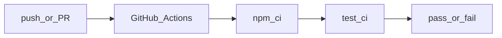

# InstallSentry

> Supply-chain blast-radius visualizer that traces npm install-time lifecycle scripts, file/network access, and secret-canary reads.

[](https://github.com/anasm266/installsentry/actions/workflows/ci.yml)
[](https://nodejs.org/)
[](https://www.typescriptlang.org/)

## At a glance

- **Problem:** `npm install` can run **lifecycle scripts** in dependencies with access to your filesystem, env, and network. That risk is **opaque** if you only read `package.json` at the top level.
- **What this is:** A **CLI** that (1) parses your **`package-lock.json` v3** into a graph, (2) runs a **sandboxed** `npm install` (host or **optional Docker**) with **canary** secrets, (3) loads a **Node shim** (`NODE_OPTIONS=--require`) to log I/O, (4) writes an **HTML report** and optional **SARIF 2.1.0**, and (5) an optional **install-time gate** (`--ci`) with **strict or allowlisted** network policy. See the **[threat model](docs/THREAT-MODEL.md)** for what is and is not guaranteed.

**Try it in three steps** (from a clone; `npx` works after the package is **published** to npm):

```bash
git clone https://github.com/anasm266/installsentry.git && cd installsentry
npm ci && npm run build
node dist/cli.js scan ./path-to-your-app
node dist/cli.js run ./path-to-your-app -o report.html
```

**Limitations (read before trusting it for production):** only **`package-lock.json` lockfileVersion 3**; **npm** (not pnpm / Yarn for the lockfile layer yet); per-event **package** is inferred from **`process.cwd()`** under the install root (not perfect if a script `chdir`s; see [adversarial notes](tests/fixtures/adversarial/chdir-demo/README.md)); the tool is **observational**—see **[`docs/THREAT-MODEL.md`](docs/THREAT-MODEL.md)**. For **`--ci`**, the default is **no network** unless you set **`--allow-hosts`** (or a config file); that keeps the gate useful on real projects that hit the registry. For a deliberate exfil test, see **[`tests/fixtures/malware-demo/`](tests/fixtures/malware-demo/)** and **[`docs/samples/`](docs/samples/)** for static HTML and policy examples.

**Security & responsible use:** The [malware-demo](#malicious-demo-fixture-canary-exfil) fixture is for **local testing and learning** on machines you are allowed to use. Do not point this tool (or the fixture) at systems you do not own, and do not use it to develop or deliver harmful code. InstallSentry is an **educational / research** tool; it is not a substitute for a commercial malware scanner, dependency policy, or formal supply-chain program.

### Example: HTML report (malware-demo)

Full-page view of a generated report in the browser. The **Secret Canary** panel shows a fake AWS canary in an outbound request URL; **Network** includes registry traffic and the `example.com` probe; the **right pane** is the Cytoscape dependency graph. The file below is committed in this repository as `docs/images/report-example.png` so it always renders on GitHub.

<p align="center">
  
</p>

To regenerate the screenshot locally: `npm run docs:screenshot` (uses the `playwright` devDependency; on Linux/macOS run `npx playwright install chromium` once. On Windows, the script uses the system **Edge** browser.)

## What it does

Every time you run `npm install`, packages can execute lifecycle scripts (`preinstall`, `install`, `postinstall`) with full access to your environment, filesystem, and network. InstallSentry tells you exactly what happened inside that black box.

- **Scans** `package-lock.json` for packages with lifecycle scripts
- **Sandboxes** `npm install` in a disposable temp directory with fake secrets
- **Traces** `fs.readFile`, `http`/`https` (including `get`), `child_process.spawn` calls via a runtime shim; canary substrings in outbound request URLs are treated as secret exfil
- **Detects** if any package reads your fake canary tokens (npm, AWS, GitHub, SSH)
- **Maps** every suspicious event back to the root dependency that introduced it
- **Reports** everything in a single interactive HTML file with dependency graph, timeline, and blast-radius paths
- **Gates CI** with `--ci` flag — fails the build if secrets are touched or unauthorized network calls are made

## Demo

```bash
# Scan a project for lifecycle scripts
npx installsentry scan ./my-project

# Run sandboxed install and generate report
npx installsentry run ./my-project --output report.html

# CI mode (strict: any network egress or secret hit fails)
npx installsentry run ./my-project --ci

# CI with a registry allowlist and SARIF for GitHub Advanced Security or upload-artifact
npx installsentry run ./my-app --ci --allow-hosts "registry.npmjs.org" -o report.html --sarif results.sarif
```

### Malicious demo fixture (canary exfil)

The repo includes [`tests/fixtures/malware-demo/`](tests/fixtures/malware-demo/): a root project with a `file:` dependency whose `postinstall` reads `AWS_SECRET_ACCESS_KEY` and issues an HTTPS request with the canary in the query string. The shim flags canary substrings in outbound URLs as **Secret Canary** hits (and still logs **Network Egress**). After `npm run build`:

```bash
node dist/cli.js run tests/fixtures/malware-demo -o malware-report.html
node dist/cli.js run tests/fixtures/malware-demo --ci
```

The last command exits with a non-zero status: both secret exfil and network are detected. Traces attribute events to a **lockfile path** (e.g. `node_modules/malice-local`) from **current working directory** under the install root, so the **Blast radius** panel and graph can highlight the responsible package.

## Architecture

```
┌─────────────────┐     ┌──────────────┐     ┌─────────────┐
│  package-lock   │────▶│  Lockfile    │────▶│  Dependency │
│    parser       │     │   Parser     │     │   Graph     │
└─────────────────┘     └──────────────┘     └─────────────┘
                                                     │
┌─────────────────┐     ┌──────────────┐            │
│   HTML Report   │◀────│   Analyzer   │◀───────────┘
│  (Cytoscape.js) │     │ (blast radius│
└─────────────────┘     │  + risk score)│
                        └──────────────┘
                               ▲
                               │
┌─────────────────┐     ┌──────────────┐
│  Secret Canary  │     │   Sandbox    │
│  Detection      │◀────│  + Shim      │
└─────────────────┘     │ (fs/net/cp)  │
                        └──────────────┘
```

## How it works

1. **Lockfile analysis** — Parses `package-lock.json` v3 into a directed acyclic graph. Identifies which packages define npm **lifecycle** scripts the tool tracks (e.g. `preinstall` / `install` / `postinstall` / `prepack` / `postpack` / `prepublishOnly` / `prepare` and related hooks—see `LIFECYCLE_SCRIPT_NAMES` in `src/graph.ts`).
2. **Sandboxed Install** — Creates a temp directory, copies `package.json` + `package-lock.json`, and runs `npm install` with:
   - Fake environment variables (`NPM_TOKEN`, `AWS_ACCESS_KEY_ID`, `GITHUB_TOKEN`, `SSH_PRIVATE_KEY`) containing canary strings
   - A Node.js runtime shim injected via `NODE_OPTIONS=--require` that monkey-patches `fs`, `http`, `https`, and `child_process` to log every call to a JSONL trace file
3. **Trace Analysis** — Reads the JSONL trace, detects canary reads, network egress, file writes, and subprocess spawns
4. **Blast Radius Mapping** — For every suspicious package, walks the dependency graph backward to find the root dependency that transitively introduced it
5. **Report Generation** — Produces a single self-contained `installsentry-report.html` with:
   - Interactive dependency graph (Cytoscape.js)
   - Secret canary alerts
   - Network egress log
   - Blast-radius dependency paths
   - CI gate status

## Installation

From the registry (after [publishing](#publishing-to-npm-optional) or if the name is available):

```bash
npm install -g installsentry
# or
npx installsentry <command>
```

From source, use `node dist/cli.js` after `npm run build` (see [At a glance](#at-a-glance)).

## Usage

### Scan

List all packages with lifecycle scripts:

```bash
installsentry scan ./my-project
```

### Run

Perform a sandboxed install and generate a report (HTML by default, optional SARIF).

```bash
installsentry run ./my-project -o report.html
# Optional: SARIF 2.1.0, Docker runner, host allowlist
installsentry run ./my-project -o report.html --sarif out.sarif --runner host
installsentry run ./my-project -o report.html --runner docker --docker-image node:20-bookworm-slim
```

**Docker runner:** requires [Docker](https://docs.docker.com/get-docker/) on `PATH`. The default image is `node:20-bookworm-slim`. The same temp project copy and trace file as the host path are used; the container only runs `npm install`. On **Windows**, use Docker Desktop and allow the temp drive to be shared if installs fail to find files.

### Network policy and CI mode

- **Default (no allow list):** any outbound HTTP(S) in the trace fails `--ci` (in addition to secret canary hits). Use this for maximum strictness in fully offline or pre-vendorized scenarios.
- **Allow list:** `installsentry run ... --ci --allow-hosts "registry.npmjs.org"` (comma-separated) so normal registry access does not fail the gate. You can set the same list in a project file: **`.installsentry.yaml`**, **`.installsentry.json`**, or `installsentry.json` (see [docs/samples/example.installsentry.yaml](docs/samples/example.installsentry.yaml)).
- **Deny list:** `--deny-hosts` (or `ci.denyHosts` in config) always fails matching hosts even if allowlisted.

```bash
installsentry run ./my-project --ci
installsentry run ./my-project --ci --allow-hosts "registry.npmjs.org"
```

### Security documentation and samples

- **[Threat model and limitations](docs/THREAT-MODEL.md)**
- **[docs/samples/](docs/samples/)** — regenerate example HTML, policy template, and SARIF notes

## Project structure

```
installsentry/
├── .github/
│   └── actions/installsentry/   # Composite “run this repo’s CLI” (needs prior build in workflow)
├── docs/
│   ├── THREAT-MODEL.md
│   └── samples/            # Regenerated report + policy / SARIF notes
├── src/
│   ├── cli.ts, config.ts, network-policy.ts, sarif.ts, install-runner.ts, docker-runner.ts, …
│   ├── lockfile.ts, graph.ts, sandbox.ts, report.ts, analyzer.ts, tracer.ts, types.ts, shim.cjs, …
├── tests/
│   ├── fixtures/ … malware-demo, lifecycle-coverage, adversarial/chdir-demo, …
│   └── *.test.ts
└── package.json
```

## Development

```bash
# Install dependencies
npm install

# Build TypeScript
npm run build

# Watch mode
npm run dev

# Run tests (watch)
npm test

# CI-style one-shot: build, optional test fixture deps, vitest run, then typecheck
npm run test:all
```

## CI (GitHub Actions)

On every push/PR to `main` or `master`, the workflow in [`.github/workflows/ci.yml`](.github/workflows/ci.yml) runs `npm ci`, `npm run test:ci`, and `npm run lint` on Node **20** and **22** (ubuntu-latest). For a visual overview of the same steps:



### Reusable “run on a project” action (in this repository)

In a **workflow in this repo** (or after checkout in another repo that contains a **built** `dist/`), you can use the composite action to run the CLI. Example: build first, then analyze a fixture.

```yaml
# Example (conceptual) — your paths may differ; requires Node and a built `dist/`
# See .github/actions/installsentry/action.yml for inputs: project-path, output, ci, allow-hosts, sarif-output, runner, docker-image
- uses: actions/checkout@v4
- uses: actions/setup-node@v4
  with:
    node-version: 20
- run: npm ci && npm run build
- uses: ./.github/actions/installsentry
  with:
    project-path: tests/fixtures/malware-demo
    output: installsentry-out.html
    ci: "false"
```

For **SARIF upload to GitHub Code Scanning**, add a job step with `github/codeql-action/upload-sarif` (requires default `security-events: write` permission) and point to the `sarif-output` path. Published packages can instead run `npx installsentry@<version> run …` in a standard `run` step.

## Publishing to npm (optional)

1. **Name:** Check if `installsentry` is free: `npm view installsentry` — if taken, publish under a **scoped** name in `package.json` (e.g. `@anasm266/installsentry`) and set `"publishConfig": { "access": "public" }`.
2. **Verify:** `npm login` / `npm whoami`, then `npm pack --dry-run` to inspect the tarball (only `dist/`, `README`, `LICENSE` by `files` in [package.json](package.json), plus the bin).
3. **Release:** `npm publish` (from a clean `git` tree at the version in `package.json`).

`prepublishOnly` runs the same checks as `npm run test:ci` so a broken build cannot be published by mistake.

## Why this exists

npm lifecycle scripts execute during `npm install` with the same privileges as the developer's shell. Supply-chain attacks have used `postinstall` scripts to steal environment variables, exfiltrate data, and drop malware. InstallSentry makes this attack surface visible, traceable, and gateable in CI.

## Roadmap (high level)

- [x] Network allow / deny and config file; SARIF; Docker install runner; threat model; samples; local composite action; expanded lifecycle names in the graph; adversarial fixture scaffolds
- [ ] pnpm / Yarn lockfile support
- [ ] Deeper per-package tracing (e.g. child `node` with shim, or documented limits only)
- [ ] Optional: publish a standalone `installsentry-action` repo for `npx` consumers without a checkout

## License

MIT
