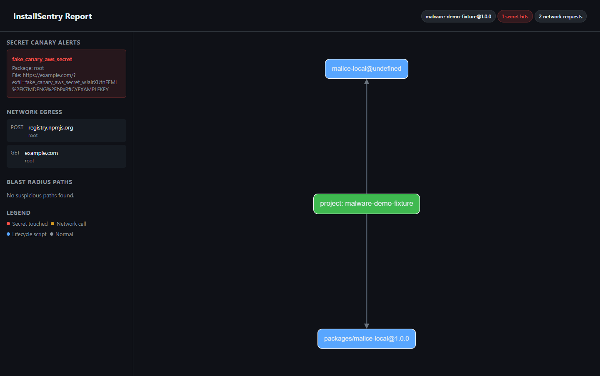

# InstallSentry

See what npm packages do during install.

InstallSentry runs `npm install` in a temporary copy of your project, traces lifecycle scripts, file access, network calls, and fake secret canary exposure, then writes an HTML report and optional SARIF for CI.

[](https://github.com/anasm266/installsentry/actions/workflows/ci.yml)
[](https://www.npmjs.com/package/installsentry)
[](https://www.npmjs.com/package/installsentry)
[](https://nodejs.org/)
[](LICENSE)

## Try the demo

Run a harmless generated demo project that simulates install-time secret exfiltration:

```bash
npx installsentry@latest demo
```

Example output:

```txt
InstallSentry found 3 install-time risks

CRITICAL  packages/malice-local      sent fake AWS secret canary to example.com
MEDIUM    Project install (npm)      made POST request to registry.npmjs.org
MEDIUM    packages/malice-local      made GET request to example.com

Observed:
  1 package with lifecycle scripts
  2 outbound network hosts
  1 secret canary hit

Report: installsentry-demo-report.html
```

## Run it on your project

From an npm project with `package.json` and `package-lock.json` v3:

```bash
npx installsentry@latest
```

This analyzes the current directory and writes `installsentry-report.html`.

## What it catches

- npm lifecycle scripts declared by packages in `package-lock.json`.
- Node filesystem reads and writes during install.
- Node HTTP(S) requests during install.
- Fake secret canary values that are read or placed in outbound URLs.
- Blast-radius paths from suspicious package behavior back through your dependency graph.

## What it cannot prove

InstallSentry is an observational tool, not a malware scanner or a safety guarantee. Native binaries, uninstrumented subprocesses, other runtimes, and evasive code can avoid the Node shim. Use Docker mode for stronger isolation and read the [threat model](docs/THREAT-MODEL.md) before relying on it as a CI gate.

## Install

InstallSentry requires Node.js 20+ and npm. Projects analyzed by the current version need a `package-lock.json` v3 file.

```bash
npm install -g installsentry
```

Or run without a global install:

```bash
npx installsentry@latest --version
```

Windows PowerShell:

```powershell
npx.cmd --yes installsentry@latest --version
```

If `npx installsentry` is not found, install locally with `npm i installsentry`, then run `npx.cmd installsentry` or `node node_modules\installsentry\dist\cli.js`.

## Commands

```bash
# Analyze the current npm project and write installsentry-report.html
installsentry

# Run the generated demo and write installsentry-demo-report.html
installsentry demo

# List packages from the current lockfile that declare install-time scripts
installsentry scan

# Analyze another project and choose the report path
installsentry run /path/to/your-app -o report.html

# Use npm ci instead of npm install
installsentry run . --npm-command ci

# CI-oriented mode: uses npm ci and exits non-zero on policy violations
installsentry ci
```

Open the generated HTML report in a browser. The report includes secret-canary hits, network egress, blast-radius paths, and an interactive dependency graph. Large projects default to a focused view; use the graph menu to switch modes.

## How it works

- Parses `package-lock.json` v3 into a dependency graph and flags packages with lifecycle scripts such as `preinstall`, `install`, `postinstall`, `prepare`, `prepack`, `postpack`, and `prepublishOnly`.
- Runs a fresh `npm install` in a temporary copy of your project on the host, or optionally inside Docker.
- Injects a small Node shim with `NODE_OPTIONS` so filesystem reads, filesystem writes, HTTP(S) traffic, and subprocess spawns from that install are logged.
- Sets fake canary values in common secret environment variables so reads or exfiltration attempts can be detected without exposing real secrets.
- Writes a self-contained HTML report and can emit SARIF 2.1.0 for tools like GitHub code scanning.
- `installsentry run` replays `npm install` by default. Use `--npm-command ci` to replay `npm ci` instead.
- `installsentry ci` replays `npm ci` and exits non-zero when secret canary rules or your network policy are violated.

## CI, network policy, and SARIF

- `--ci` exits non-zero when the analysis fails your policy. By default, any outbound HTTP(S) in the trace counts as a failure, plus secret-canary rules. For real projects that must talk to the registry, use an allow list.
- `--allow-hosts` accepts comma-separated hosts, such as `registry.npmjs.org`. You can set the same in `.installsentry.yaml`, `.installsentry.json`, or `installsentry.json`.
- `--deny-hosts` lists hosts that always fail, even if allowlisted.
- `--sarif <file>` writes SARIF alongside the HTML report.

Local command:

```bash
installsentry ci ./my-app --allow-hosts "registry.npmjs.org" -o report.html --sarif results.sarif
```

## Docker

Run the install step inside a container when you want a stronger isolation boundary than the default host temp-directory runner:

```bash
installsentry run ./my-app --docker -o report.html
```

`--docker` is a shorthand for `--runner docker`. Use `--docker-image` when you need a specific Node image:

```bash
installsentry run ./my-app --docker --docker-image node:20-bookworm-slim -o report.html
```

On Windows, use Docker Desktop and ensure the temp directory volume is shareable if installs fail.

## GitHub Actions

Use the published CLI with `npx`:

```yaml
- uses: actions/setup-node@v4
  with:
    node-version: 20
- run: npx --yes installsentry@latest ci ./my-app --allow-hosts registry.npmjs.org --sarif installsentry.sarif
- uses: github/codeql-action/upload-sarif@v3
  if: always()
  with:
    sarif_file: installsentry.sarif
```

For PowerShell-based Windows jobs, use `npx.cmd`.

To run the composite action in this repository, see [`.github/actions/installsentry/action.yml`](.github/actions/installsentry/action.yml) and the note in [CONTRIBUTING.md](CONTRIBUTING.md#in-repo-github-action). The published CLI path is the recommended path for most users.

## Example report

<p align="center">
  
</p>

Reference run on the canary demo scenario included in the GitHub repository.

## Limitations

| Area | Note |
| --- | --- |
| Lockfile | `package-lock.json` v3 only. |
| Client | npm install semantics only; pnpm and Yarn lockfiles are not supported yet. |
| Attribution | Package attribution is derived from working directory under the project root. Scripts that `chdir` or spawn an unshimmed child Node process can misattribute events. |
| Trust | Use for visibility and policy gates, not as a replacement for full security review. |

Details: [docs/THREAT-MODEL.md](docs/THREAT-MODEL.md). Samples and policy templates: [docs/samples/](docs/samples/).

## Documentation

| Doc | Purpose |
| --- | --- |
| [docs/THREAT-MODEL.md](docs/THREAT-MODEL.md) | What the tool can and cannot prove; evasion notes |
| [docs/samples/](docs/samples/) | Config examples, SARIF, policy |
| [docs/ADOPTION-ROADMAP.md](docs/ADOPTION-ROADMAP.md) | Adoption backlog and implementation roadmap |
| [CHANGELOG.md](CHANGELOG.md) | Release history |

## Contributing

Pull requests and issue reports are welcome. See [CONTRIBUTING.md](CONTRIBUTING.md) for how to build and test locally.

## License

MIT
